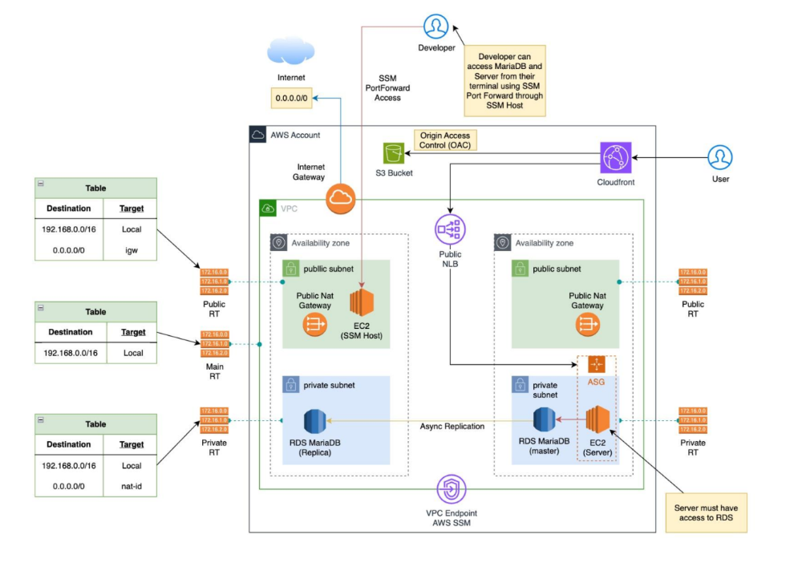
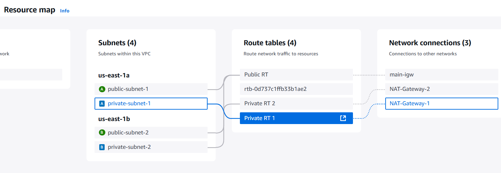
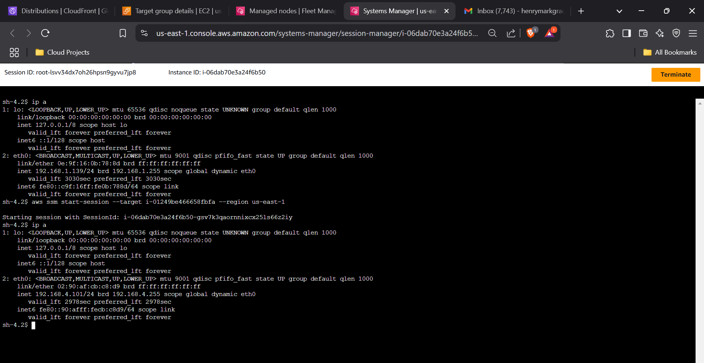
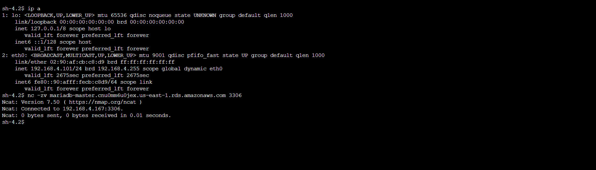
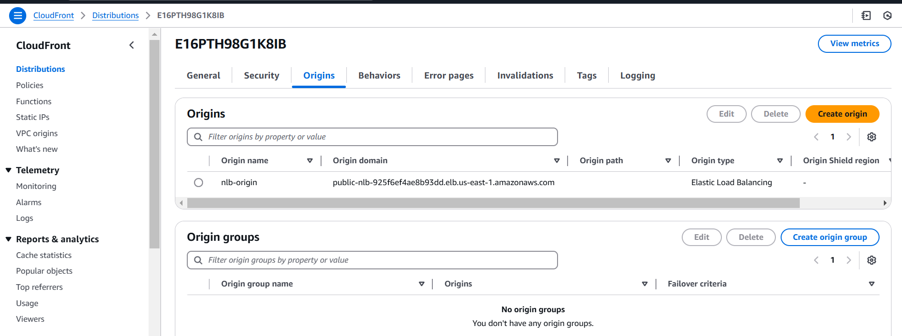

# AWS Architecture Deployment with Terraform

## Overview
This repository contains the Terraform code to deploy a high-availability, secure, and scalable AWS architecture.

## Architecture Diagram

> ⚙️ **Key Components:**
- VPC with public and private subnets in two Availability Zones.
- Public NAT Gateways for internet access from private subnets.
- EC2 instances used for SSM Host (jump host) and application server (ASG enabled).
- RDS MariaDB Master and Replica instances for database operations.
- Public Network Load Balancer (NLB) to distribute traffic.
- CloudFront distribution.
- VPC Endpoint for secure AWS SSM access.
- Routing tables for public and private subnets.
- IAM roles and security groups configured for all services.

> ⚙️ **Snapshots:**

- VPC Resource Map
  
  
- PortForwarding to Private Server using AWS SSM Agent
  
  
- Private Server to MariDB connection
  
  
- CloudFront Interface
  
        
